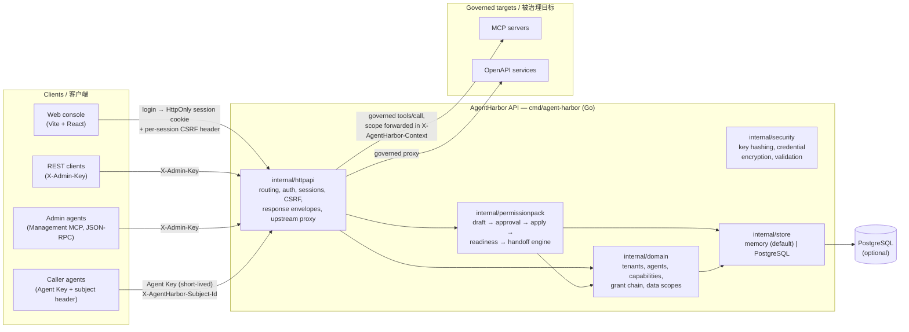

# AgentHarbor Technical Map / 技术图谱

One-page orientation for engineers: what the moving parts are, how they connect, and where each concern lives in the repository. Reference detail for individual topics stays in the dedicated documents linked from the final section.

面向工程师的一页式导览:系统有哪些组成部分、如何连接、每个关注点落在仓库的什么位置。各主题的细节仍由文末索引的专门文档承载。

Last reviewed: 2026-10-03, baseline v0.6.1.

## System at a glance / 系统总览



Three planes share one binary / 三个面共用同一个二进制:

- **Management plane**: REST + Management MCP for administrators and admin agents. Requires admin authentication (shared key, named identities, or console session).
- **Data plane**: governed MCP / OpenAPI proxy calls authenticated by short-lived Agent Keys (or one-time Access Handoff tokens).
- **Console plane**: the web console signs in via `/api/v1/auth/login` and uses an HttpOnly session cookie with a session-bound CSRF header.

## Repository layout / 仓库结构

| Path | Contents |
| --- | --- |
| `cmd/agent-harbor/` | Binary entrypoint; config wiring, server startup, production preflight. |
| `internal/httpapi/` | HTTP surface: routing, auth/session, admin scoping, holder scope, Management MCP, target probe, upstream proxy, response/security headers. |
| `internal/permissionpack/` | Permission-package engine: drafts, policy gate, approval lifecycle, apply, health/impact/readiness, access handoff. |
| `internal/domain/` | Core model: tenants, agents, capabilities, grant chain, data scopes, admin identities, errors. |
| `internal/security/` | Key generation/hashing, credential encryption (`AGENT_HARBOR_CREDENTIAL_KEY`), input validation. |
| `internal/store/` | Repository implementations: in-memory (default) and PostgreSQL; approval/application duplicate guards. |
| `internal/db/` | Migration runner + `migrations/` (16 SQL migrations, `001` … `016`). |
| `internal/contracts/` | Provider/channel contracts surfaced under `/api/v1/contracts/*`. |
| `frontend/` | Web console: Vite + React + TypeScript (see below). |
| `scripts/` | Demo stack, real-MCP SDK service, 20+ executable scenario gates, shared lib. |
| `docs/engineering/` | Release notes per version, plans/designs, review records, this map, API reference. |
| `docs/product/` | PRDs, journey notes, external evaluation archive (`0.4.0-console-eval.md`, rounds 4–7). |
| `docs/superpowers/` | Dated plan/design pairs from the 2026-06 hardening sprints. |

## Backend module notes / 后端模块说明

- `server.go` (httpapi) keeps construction, route registration, middleware, and admin authentication; handlers are split by concern into sibling files: auth, admin identities/scope, holder scope, registry (tenants/agents/keys), route policies, capabilities, the permission-package family (applications, readiness, approvals, visibility), grant chain, data plane, observability, access profile, access handoff, Management MCP, target probe, and the tenant permission center. The binary's HTTP server uses bounded connection settings: 5s read-header, 15s read, 35s write, 60s idle timeouts, 1 MiB header limit.
- The permission-package engine is deliberately the only writer of grant-chain changes: REST and Management MCP both funnel through it, so approval consumption, drift checks, and audit records behave identically for human and AI administrators.
- Storage is repository-pattern: in-memory for local evaluation (empty on restart), PostgreSQL for persistence. Migrations are forward-only SQL files run by `internal/db`.
- Production preflight (`AGENT_HARBOR_DEPLOYMENT_MODE=production`) blocks weak/conflicting bootstrap keys, reserved actors, scoped-role inconsistencies, malformed reviewer routing, weak session secrets, missing storage/credential keys, invalid CORS origins, and development-only flags **before** the HTTP server or storage starts.

## Frontend layer map / 前端分层

| Layer | Path | Role |
| --- | --- | --- |
| Entry | `src/main.tsx` → `RootEntry.tsx` → `redesign/RedesignApp.tsx` | Hash routing, surface switch, login gate. |
| Shell | `redesign/shell/` | Sidebar, topbar, command palette (⌘K), notification center, data-status banner, login card. |
| Views | `redesign/views/user/*`, `redesign/views/admin/*` | Dual-surface pages: user workbench (ask/apply/mine/go-live) and admin console (cockpit, approvals, capabilities, registry, tenants, policies, routes, traces, admin boundaries). |
| Hooks | `redesign/hooks/` | Per-page data controllers (env checks, approvals, permission-change flow, runtime validation, notifications …). |
| Model | `redesign/model/` | Pure presenters/state machines (env checks, approval review, secret masking, table columns …) — unit-tested with `node --test`. |
| Shared | `src/*.ts` (root) | API client (`api.ts`), path builders (`apiPaths.ts`), journey/presenter modules, i18n (`i18n.ts`, zh/en parity), types. |
| UI kit | `redesign/ui/` | Buttons, cards, chips, modals, tables, toasts, steppers. |

Conventions worth knowing: modules reachable from `node --test` carry `.ts` extensions on relative imports (vite-only files may omit them); every visible string lives in `i18n.ts` in both languages with parity enforced by tests; secrets render only as masked prefixes (`secretMask.ts`).

## Domain model / 领域模型

Grant chain (who may call what, narrowed layer by layer):

```text
Tenant entitlement (capability granted to a tenant)
  └─ Workspace assignment (narrowed to a workspace)
       └─ Instance assignment (narrowed to a caller instance)
            └─ Runtime decision (allow/deny + trace + audit)
```

- `dataScopes` are hierarchical OR alternatives. A child assignment may fill an empty parent dimension but can never change a fixed parent dimension (e.g. `region`, `tenantFilter`). Runtime traces record the effective inherited scope list, and governed `tools/call` forwards it in `X-AgentHarbor-Context`.
- MCP capabilities must be approved before they can be granted. Route policies (priority, wildcard, deny-wins-ties) gate both MCP and OpenAPI routes; direct access grants remain as a compatibility fallback.
- MCP lifecycle methods (`initialize`, `ping`, `notifications/*`) are synthesized by the gateway so standards-compliant clients complete handshakes without upstream round-trips; explicit route policies still take precedence.

Permission-package lifecycle (the controlled change path):

```text
draft (deterministic template, exact-capability option)
  → preview (allow/deny simulation)
  → preflight (read-only safety checks; policy gate decides approval need)
  → approval request (expire 24h, no self-approval, one-time consumption)
  → apply (snapshots template version + fingerprints; rejects drift)
  → application record → health / impact review / production readiness
  → Access Handoff (bounded config, one-time short-lived token, revocable)
```

Readiness is a derived gate: it recombines preflight, the latest application, health, impact, access profile, runtime allowed/denied traces, and the applied audit event into `ready / needs-review / blocked`, with stable `nextActionCode` and `blockerCodes` for UI and admin-agent localization.

## Authentication surfaces / 认证面

| Surface | Credential | Notes |
| --- | --- | --- |
| REST management | `X-Admin-Key` (shared) or named identity key | Scoped roles (`tenant_admin`, `security_reviewer`) bounded to tenant/workspace; separation of duties enforced (requester ≠ reviewer). |
| Web console | `/api/v1/auth/login` → HttpOnly `agent_harbor_session` cookie | Session-bound CSRF header on unsafe methods; `Secure` cookie behind TLS/trusted proxy; rotation/disable invalidates sessions. |
| Management MCP | Same admin authentication as REST | Same permission-package engine, same audit trail; tool catalog carries safety/access metadata. |
| Data plane | Short-lived Agent Key (+ `X-AgentHarbor-Subject-Id` when applicable) | One-time Access Handoff tokens are additionally bound to their application's subject/target. |
| Holder scope | `ownedAgentIds` on managed identities | Non-platform identities bound to caller agents see only their owned callers on the user surface (`403 HOLDER_SCOPE_DENIED` server-side); rebinds apply on the next request. |

Bootstrap identities from env are read-only break-glass; day-to-day administrators are managed identities created in the console (keys shown once, rotation/disable act as containment).

## Security posture summary / 安全基线摘要

- All responses: `Permissions-Policy`, `Referrer-Policy: no-referrer`, `X-Frame-Options: DENY`; HTTPS adds HSTS; JSON adds `X-Content-Type-Options: nosniff`; management/session responses are `no-store`.
- Body limits: 1 MiB management JSON (single complete JSON value), 4 MiB data-plane proxy; OpenAPI relative paths reject decoded traversal markers.
- Loopback/private upstreams rejected unless `AGENT_HARBOR_ALLOW_PRIVATE_UPSTREAMS=true` (development only).
- Secrets: agent/admin keys are hashed at rest; credentials encrypted via `AGENT_HARBOR_CREDENTIAL_KEY`; plaintext keys are shown exactly once on create/rotate and never returned by list/audit APIs; the console renders masked prefixes only.
- Panics recover into the standard JSON error envelope (`INTERNAL_ERROR`) without leaking details.

The authoritative, executable statement of these rules is the `make production-hardening` gate; this section only summarizes it.

## Verification topology / 验证拓扑

| Gate | Command | Covers |
| --- | --- | --- |
| Dev check | `make check` | Go build/tests, gofmt, vet, frontend tests (269) + `tsc` build, script/YAML lint. |
| Release gate | `make release-check` | Uncached Go tests + release scenario gates (production safety baseline, approval journey, AI-admin browser journey, admin boundary, managed-admin lifecycle, tenant permission center, console production journey). |
| Evaluator pack | `make evaluation-readiness` | Walkthrough + environment snapshot for external evaluation rounds. |
| PG integration | `make test-postgres` (opt-in) | Repository tests against a real PostgreSQL (`AGENT_HARBOR_TEST_DATABASE_URL`). |
| CI | `.github/workflows/ci.yml` | Same gates on PRs and main; Node 24/26 matrix. |

External evaluation runs on released baselines; rounds 4–7 are archived in `docs/product/0.4.0-console-eval.md`.

## Documentation map / 文档索引

- API endpoints and per-endpoint semantics: [api-reference.md](api-reference.md)
- Release process and gates: [release-checklist.md](release-checklist.md); per-version notes: `0.*-release-notes.md`
- Management MCP compatibility aliases: [management-mcp-compatibility-aliases.md](management-mcp-compatibility-aliases.md)
- Product direction: [ROADMAP.md](../../ROADMAP.md); public changes: [CHANGELOG.md](../../CHANGELOG.md)
- Product specs and evaluation archive: `docs/product/` (PRDs, journey notes, `0.4.0-console-eval.md`)
- 2026-06 hardening sprint plans/designs: `docs/superpowers/`
