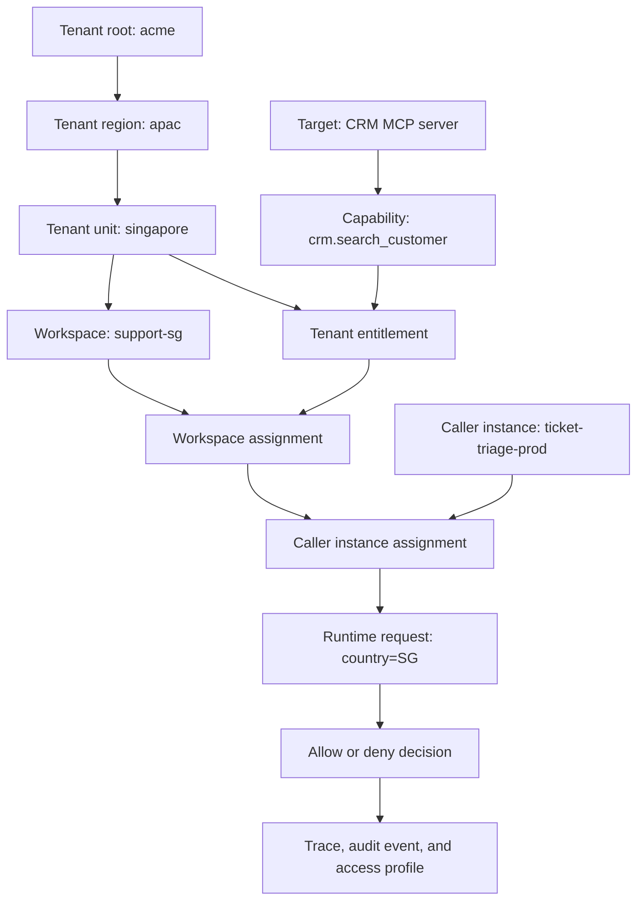

# Tenant Hierarchy and Permission Flow

AgentHarbor answers one access question at runtime: can this caller instance use this capability for this data scope, inside this tenant and workspace? The answer becomes more specific at every assignment boundary. A lower boundary can narrow access, but it cannot broaden an earlier grant.

AgentHarbor 在运行时回答一个访问问题：某个调用方实例能否在指定租户和工作区内，以指定数据范围使用某项能力？每经过一层分配边界，权限都会变得更具体；较低层级只能收窄上层授权，不能扩大它。

## Concrete example

Consider an internal support Agent that looks up customer tickets for the Singapore support team.

以一个面向新加坡客服团队、查询客户工单的内部 Agent 为例：

| Boundary | Example | What it establishes |
| --- | --- | --- |
| Tenant hierarchy | `acme` -> `apac` -> `singapore` | The organization subtree that owns the request. |
| Workspace | `support-sg` | The operational area inside that tenant subtree. |
| Caller instance | `ticket-triage-prod` | The deployed Agent instance making the request. |
| Target capability | `crm.search_customer` | The discovered MCP or OpenAPI capability the Agent wants to use. |
| Data scope | `country=SG` | The records this capability may return for this request. |

The same model applies when the target is an MCP server, an OpenAPI service, or a governed data source. The target type changes; the assignment chain does not.

同一个模型适用于 MCP Server、OpenAPI 服务和受治理数据源：目标类型可以不同，但授权链保持一致。

## How access narrows

At runtime, AgentHarbor evaluates the effective permission as the intersection of the approved capability, tenant entitlement, workspace assignment, caller-instance assignment, and requested data scope. An allow decision means every relevant boundary matched. A deny decision identifies the boundary that prevented the request.

运行时，AgentHarbor 会将已批准的能力、租户授权、工作区分配、调用方实例分配和请求数据范围求交集，得到有效权限。允许表示所有相关边界都匹配；拒绝则会指出阻止请求的具体边界。

## Reading common outcomes

| Runtime request | Expected outcome | Why |
| --- | --- | --- |
| `ticket-triage-prod` searches a Singapore customer through `crm.search_customer` | Allowed | The caller, workspace, capability, and `country=SG` data scope all match the assignment chain. |
| The same caller searches a Malaysia customer | Denied | The requested record is outside the effective `country=SG` data scope. |
| An unassigned caller instance uses `crm.search_customer` | Denied | A tenant or workspace grant alone is not enough; the caller instance must receive the capability through the full assignment chain. |
| The caller tries a different discovered capability | Denied | Discovery does not grant access. The capability needs its own approval and assignments. |

This is why the console starts from an access question: before changing a permission, operators can inspect which boundary allowed or denied the request, then use the same context to prepare a safe permission change.

这也是控制台从访问查询开始的原因：在修改权限前，运营人员可以先查看究竟是哪一层允许或拒绝了请求，再携带同一上下文发起安全的权限变更。

## What to inspect after a decision

- **Access profile**: the effective grants and scope rows for a tenant.
- **Runtime trace**: the caller, target, capability, requested scope, allow or deny result, and deny reason.
- **Audit record**: the approval and permission-change history that led to the active assignment.

Together, these records let platform, security, and tenant operations teams explain not only whether a request was allowed, but also why.

通过权限画像、运行 trace 和审计记录，平台、安全和租户运营团队不仅可以知道请求是否被允许，也可以解释其原因。
