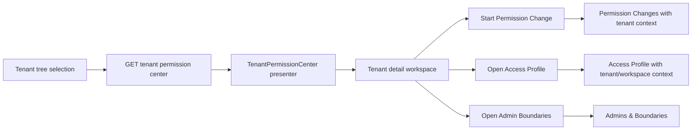

# Tenant Permission Center Design

## 中文摘要

本轮不重做租户树，也不引入完整 IAM / SSO。现有 **Tenants & Organization / 租户与组织** 已能展示层级、工作区、访问对象，并能把上下文带入权限变更。下一步应把它升级为 **Tenant Permission Center / 租户权限中心**：用户选中一个租户后，可以直接理解这个租户的组织边界、负责管理员、工作区、访问对象、已授权权限包、允许/禁止能力、数据范围和下一步动作。

权限写入仍然必须回到 **Permission Changes / 权限变更**，因为审批、预检、应用、运行验证和上线状态必须保持在受控主旅程里。租户权限中心只提供只读治理摘要和安全的上下文跳转。

## Goal

Make tenant management answer the operator's real question:

> For this tenant, who can manage it, what can its teams use, what is blocked, and what is the next safe action?

The page should feel like a production B2B control plane, not a debug view over tenant IDs and grant tables.

## Existing State

The repository already has:

- `frontend/src/tenantOrganization.ts`: pure presenter for tenant tree and selected-tenant summary.
- `frontend/src/components/TenantOrganizationView.tsx`: tenant tree, selected tenant overview, access object directory, and modal handoff into Permission Changes.
- `GET /api/v1/tenants`, `POST /api/v1/tenants`, and `GET /api/v1/tenants/{id}/access-profile`.
- Entitlement, workspace assignment, instance assignment, capability, trace, and audit APIs.
- Managed administrator identities with tenant/workspace boundaries from PR #92.
- Scoped tenant administrators enforced across management APIs and management MCP.

The gap is not raw capability. The gap is product coherence: tenant, admin boundary, permission packages, access profile, and next action are still spread across multiple workspaces.

## Product Decision

Use approach B: make the selected tenant detail page the tenant permission command center.

Rejected alternatives:

- **Only enhance the current page:** too shallow. It would still say "start a permission change elsewhere" without showing the tenant's permission state.
- **Build full IAM:** too large. Real user lifecycle, departments, identity provider sync, and SSO should not enter this slice.
- **Directly edit grants in the tenant page:** unsafe. It would bypass the permission-package approval and status-check journey that defines AgentHarbor's value.

## User Experience

The workspace keeps the current left tree plus right detail layout, but the right side becomes a guided tenant permission center.

Primary sections:

1. **Tenant Header**
   - Business tenant name and hierarchy path.
   - Current operator scope: platform-wide, tenant subtree, or workspace-bound.
   - Primary action: start permission change.
   - Secondary actions: view access profile, manage administrators.

2. **Permission Snapshot**
   - Permission packages applied to this tenant.
   - Allowed capability count and blocked capability count.
   - Data scope summary.
   - Status: ready, needs configuration, blocked, or no permissions.

3. **Administrator Boundary**
   - Platform admins see managed administrators assigned to the selected tenant or its subtree.
   - Tenant admins see their own boundary and a read-only explanation.
   - Bootstrap identities remain visible only as "external break-glass" context when relevant.

4. **Workspace And Access Objects**
   - Workspaces with caller/target counts.
   - Roles, departments, and members available in that workspace.
   - Selecting an access object can prefill the permission-change modal but never auto-submit.

5. **Current Permission Detail**
   - Business-readable capabilities and data scopes.
   - Advanced details disclose entitlement, workspace assignment, and instance assignment IDs.
   - Empty states point to the next safe action rather than showing empty grant tables.

## Backend Design

Add a read-only projection endpoint:

```text
GET /api/v1/tenants/{id}/permission-center?workspaceId=
```

The endpoint returns a denormalized summary built from existing repository data:

```ts
interface TenantPermissionCenterResponse {
  tenant: Tenant
  scopeTenants: Tenant[]
  operatorBoundary: {
    actor: string
    role: AdminIdentityRole
    tenantId?: string
    workspaceId?: string
    canManageAdministrators: boolean
  }
  administrators: {
    id: string
    actor: string
    displayName: string
    role: AdminIdentityRole
    tenantId?: string
    workspaceId?: string
    status: AdminIdentityStatus
    source: AdminIdentitySource
  }[]
  workspaces: {
    workspaceId: string
    callerCount: number
    targetCount: number
    assignmentCount: number
  }[]
  permissionPackages: {
    templateId: string
    templateName: string
    status: "ready" | "needs_review" | "blocked"
    allowedCapabilityCount: number
    blockedCapabilityCount: number
    dataScopes: DataScope[]
    latestApplicationId?: string
  }[]
  capabilities: {
    targetId: string
    targetName: string
    capabilityId: string
    capabilityName: string
    effect: "allow" | "deny"
    dataScopes: DataScope[]
    workspaceIds: string[]
  }[]
  nextActions: {
    code: string
    targetView: "ai-admin" | "access" | "admin-access" | "getting-started"
  }[]
  generatedAt: string
}
```

Implementation principles:

- Reuse access-profile and permission-package presenter logic where possible.
- Do not expose secret material or key hashes.
- Apply the same `effectiveManagementScope` and tenant subtree checks as existing list APIs.
- Tenant admins can request only their allowed tenant subtree; platform admins can inspect any tenant.
- Unknown/unregistered tenant IDs should not create synthetic administrative authority. Keep the existing access-profile compatibility behavior for direct access-profile calls, but make the permission-center projection require a registered tenant so the UI does not present a free-form tenant string as an organization node.

## Frontend Design

Add a pure presenter:

```text
frontend/src/tenantPermissionCenter.ts
```

Responsibilities:

- Normalize the API projection for UI sections.
- Select the current workspace.
- Translate technical status into business-facing next action codes.
- Produce compact lists for permission packages, capabilities, administrators, workspaces, and access objects.

Update:

- `TenantOrganizationView.tsx` to render the permission-center summary when available.
- `ConsoleController.tsx` to load the projection when `#tenants` is active.
- `api.ts` and `types.ts` with the new response type and client.
- `i18n.ts` with English and Simplified Chinese copy.

The view should not grow into another large state component. Local state is limited to selected tenant, selected workspace, and handoff modal. Projection loading state belongs in a small hook or controller helper if it becomes more than a few lines.

## Data Flow



The projection is read-only. Mutations stay in their existing flows.

## Security And Stability

- The tenant center must never create, update, or delete grants directly.
- Tenant administrators must not discover administrators outside their assigned boundary.
- Managed administrator keys remain one-time only and do not appear in this projection.
- Permission package state is summarized from applications and grants; stale or drifted state must show `needs_review` or `blocked`, not `ready`.
- Empty data must produce useful next actions, not fallback sample data that looks durable.

## Testing

Backend:

- Platform admin can fetch any tenant center.
- Tenant admin can fetch own tenant and subtree.
- Tenant admin cannot fetch outside tenant or workspace boundary.
- Projection redacts key material and key hashes.
- Projection summarizes administrators, workspaces, permission packages, capabilities, and next actions.

Frontend:

- Presenter tests for ready, empty, blocked, and scoped-admin cases.
- i18n key parity for English and Simplified Chinese.
- Layout/source tests ensure the tenant page uses the permission-center projection and keeps raw IDs in advanced detail.
- Handoff tests verify tenant context flows into Permission Changes, Access Profile, and Admin Boundaries without auto-submission.

Scenario:

- Platform admin creates a tenant admin.
- Tenant admin logs in.
- Tenant admin sees only the assigned tenant subtree.
- Tenant admin starts a permission change from the tenant center.
- Out-of-scope tenant center access is rejected.
- `make check` and `make release-check` include the new scenario.

## Non-Goals

- No SSO, IdP sync, password login, or full user lifecycle.
- No direct grant editing from the tenant page.
- No new permission package resource type.
- No Access Handoff or My Access portal in this slice.
- No visual redesign of the entire console shell.

## Acceptance Criteria

- The tenant workspace clearly answers who manages this tenant, what it can use, what is blocked, and what to do next.
- Platform administrators see administrator boundary summaries; tenant administrators see a bounded read-only view.
- Permission changes remain the only write path for tenant permissions.
- Main UI uses business names first and keeps raw IDs in advanced details.
- English and Simplified Chinese copy are complete.
- Focused tests, frontend tests/build, `make check`, `make release-check`, and browser smoke pass.
