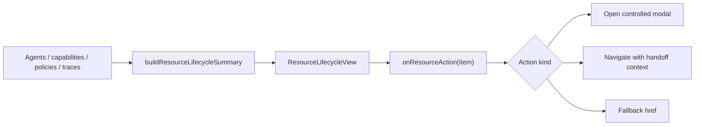

# Resource Lifecycle Inline Actions Design

## Context

Resource Management is now the single visible entry for Agent, credential, and route-policy creation. The remaining experience gap is that each resource row still sends operators to another workspace for the next step. This makes Resource Management feel like an index rather than a production workflow.

The next increment should keep the page quiet and operational while letting users act on a resource without losing context.

## Goal

Turn Resource Management into a resource-by-resource workflow surface:

- A resource row explains its current blocker in business language.
- The primary next action opens the right in-page action, not a blind cross-page jump.
- Specialist workspaces still own heavy workflows, but Resource Management passes a focused handoff when the user must leave the page.

## Decisions From Design Review

### 1. Resource Management should not absorb every specialist page

Resource Management remains a lifecycle cockpit. It should not duplicate the full capability catalog, permission-change workbench, or runtime audit table. Those pages remain the right place for deep review.

Recommended boundary:

- In-page modal: create Agent, create key, rotate credential, create policy, inspect current resource blocker.
- Handoff link with context: capability discovery, permission change, runtime validation.
- No new backend endpoints in this increment.

### 2. Row actions need resource context

Current rows only expose `nextActionHash` and `nextActionKey`. The UI cannot tell whether `配置资源` should open credential rotation, Agent details, or a generic registry jump. Add a small frontend model field:

```ts
export type ResourceLifecycleActionKind =
  | "create_agent"
  | "create_key"
  | "rotate_credential"
  | "review_capabilities"
  | "start_permission_change"
  | "review_runtime"
  | "review_resource";
```

Each row receives `nextActionKind`, while `nextActionHash` remains as the fallback navigation target.

### 3. Empty-state and row actions should differ

When there are no resources, the page should still show one primary command: create Agent. It should not show a row-style blocker because there is no resource context.

When resources exist, each row should have a business-readable next action. Examples:

- MCP target with no credential: `配置凭据`
- MCP target with no capabilities: `发现能力`
- Target needing authorization: `发起权限变更`
- Resource with no runtime decisions: `运行验证`
- Ready resource: `查看运行`

### 4. Use one shared action surface

Do not create three new modal systems. Extend the existing `ActionModalButton` and ResourceLifecycleView composition so command buttons and row actions share visual treatment.

The row should call an `onResourceAction(item)` callback. `ConsoleController` decides whether to:

- Open an existing action modal by setting a controlled modal id.
- Switch to a specialist workspace with handoff context.

This keeps `ResourceLifecycleView` presentational and avoids another controller-sized component.

### 5. Capability and permission handoffs should be explicit

For `review_capabilities`, navigate to `#capabilities` and preselect the resource target if the target is MCP-capable.

For `start_permission_change`, navigate to `#ai-admin` and prefill the most likely target/caller context only when the existing local data is sufficient. If the frontend cannot infer a safe caller or template, it should navigate with a short notice instead of silently guessing.

### 6. Runtime validation should not be faked

For `review_runtime`, navigate to `#traces` and prefill trace filters for the resource. This increment should not invent a synthetic "run validation" call from the row. Actual runtime calls remain part of the demo/scenario or external client behavior.

## UX Shape

The Resource Management page keeps the current order:

1. Metrics and lifecycle stage rail.
2. Compact command bar for global creation actions.
3. Resource lifecycle list.
4. Agent registry and contract matrix.

Row changes:

- The rightmost action becomes a button for in-page actions and a link only for pure navigation.
- Rows expose a short secondary blocker detail under the status or resource name.
- Technical IDs stay hidden in the row.

Modal changes:

- Existing create/credential/policy forms remain in independent modal panels.
- Row-triggered modal titles include the target resource name where useful.
- Modal actions must remain keyboard-focusable and use existing focus-visible tokens.

## Data Flow



## Testing Strategy

Add focused tests before implementation:

- `resourceLifecycle.test.mjs` asserts action kind selection for credential, capability, authorization, runtime, ready, and disabled states.
- `styleTheme.test.mjs` asserts ResourceLifecycleView uses `onResourceAction`, does not import management forms, and avoids raw technical ids in rows.
- Existing i18n tests assert new row action/detail copy exists in English and Simplified Chinese.

Then run:

```bash
pnpm --dir frontend exec node --test tests/resourceLifecycle.test.mjs tests/styleTheme.test.mjs tests/i18n.test.mjs
pnpm --dir frontend test
pnpm --dir frontend build
git diff --check
make check
make release-check
```

## Non-goals

- No backend changes.
- No new dependencies.
- No batch operations.
- No real runtime invocation from the browser.
- No replacement of Permission Changes, Capability Governance, or Runtime Audit as specialist workspaces.

## Acceptance Criteria

1. Resource lifecycle rows have explicit action kinds and business-readable next action labels.
2. Credential-related next actions open in-page modal actions.
3. Capability, permission, and runtime next actions preserve resource context when navigating.
4. Empty resource state remains a simple create-first path.
5. Resource Management still feels like a B-side operations page, not a demo dashboard or form gallery.
6. Frontend, i18n, docs, tests, and browser validation are included in the final PR.
